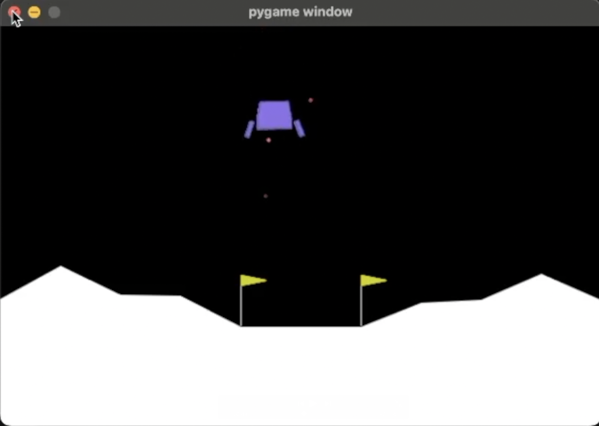
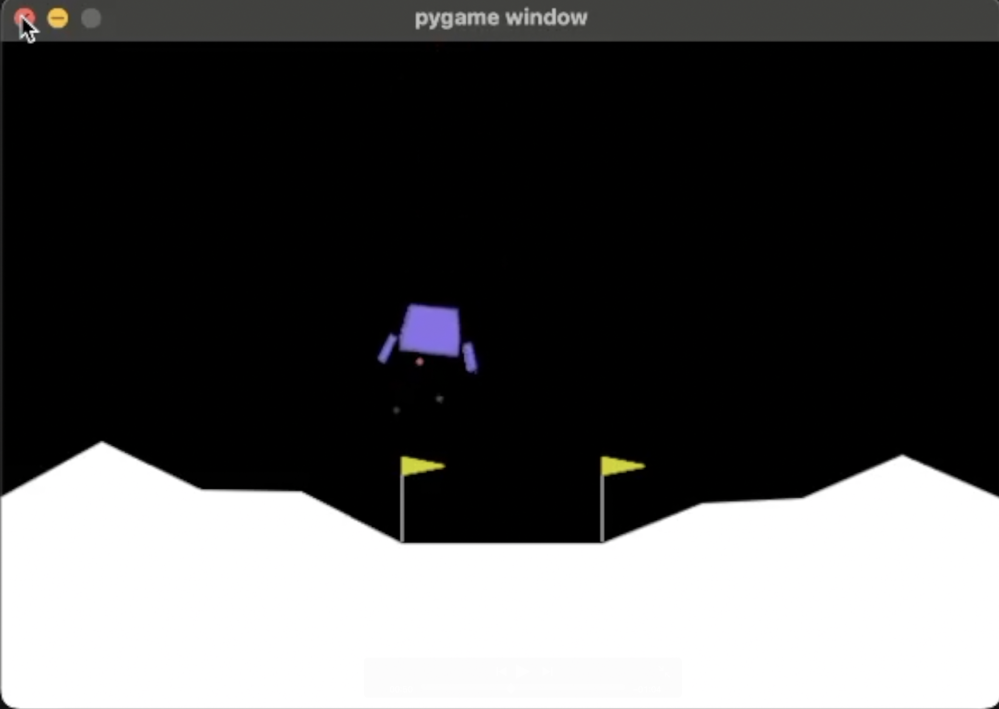
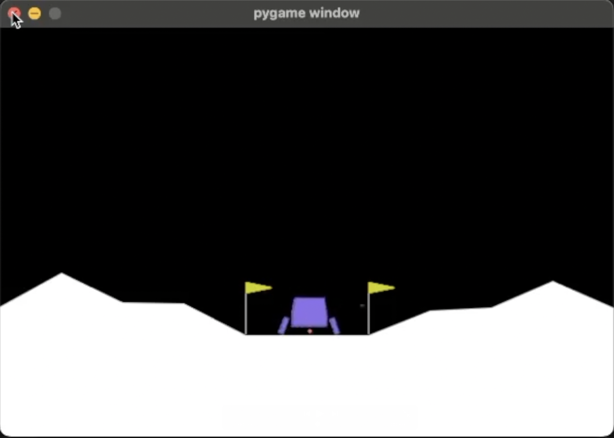

# Lunar Lander AI 🚀

This project trains a reinforcement learning agent to land safely in the **LunarLander-v3** environment from [Gymnasium](https://gymnasium.farama.org/).  
The agent is trained using **Proximal Policy Optimization (PPO)** from [Stable-Baselines3](https://stable-baselines3.readthedocs.io/), with **custom reward shaping** designed to encourage smooth decelerations, upright posture, and precise center landings.

---

## 🎯 Iteration 6 – Final Model

Earlier iterations experimented with different reward structures.  
**Iteration 6** represents the final training run with a refined reward shaping wrapper:

- Strong penalties for drifting away from the landing pad.  
- Penalties for high velocity near the ground.  
- Rewards for stable landings with both legs.  
- Penalties for repositioning after touching down.  
- Strong terminal reward for precise, centered landings.  

This ensures the agent avoids “gaming” the environment and instead learns smooth, realistic landings.

---
## 📸 Demo

### Screenshots

**Start of Training**  


**Approach**  


**Landing**  


---

### 🎥 Video Demo

Watch the trained agent in action:  
[▶️ Watch on YouTube](https://youtu.be/tH0pOOpzQyM)


## 📂 Project Structure
```text
Akers_final_project/
├── docs/
│   ├── screenshots/
│      ├── pic1.png   # Start of training
│      ├── pic2.png   
│      └── pic3.png   # Successful landing
├── Akers_Final_Project.ipynb              # training & evaluation scripts
└── README.md

python3 -m venv venv
source venv/bin/activate    # macOS/Linux
# .\venv\Scripts\activate   # Windows
